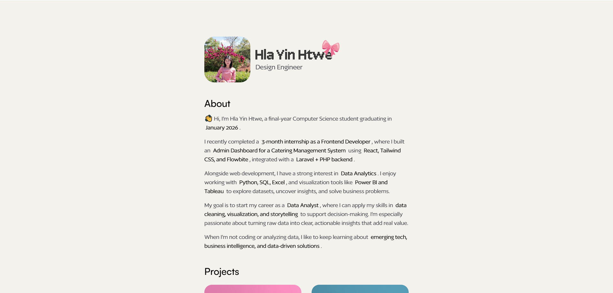

# 🌐 Portfolio Website

🚀 **Live Demo** 🔗 [View Portfolio](https://thinakaranmanokaran.github.io/Hlayinhtwe_Portfolio/)


This is a **modern, animated personal portfolio website** built with **Vite**, **React**, **TailwindCSS**, and **Framer Motion**.
Originally designed in **Notion**, it has been transformed into a **fast, beautiful, and responsive** web experience.

[](https://thinakaranmanokaran.github.io/Hlayinhtwe_Portfolio/)

---

## ✨ Features

* ⚡ **Blazing fast** performance with [Vite](https://vitejs.dev/)
* 🎨 **Modern styling** using [TailwindCSS](https://tailwindcss.com/)
* 🎬 **Smooth animations** powered by [Framer Motion](https://www.framer.com/motion/)
* 📱 **Fully responsive** design (Mobile, Tablet & Desktop)
* 🧩 **Clean code structure** for easy customization

---

## 🚀 Getting Started

### 1️⃣ Clone the Repository

```bash
git clone https://github.com/thinakaranmanokaran/Hlayinhtwe_Portfolio.git
cd Hlayinhtwe_Portfolio
```

### 2️⃣ Install Dependencies

```bash
npm install
```

### 3️⃣ Run Development Server

```bash
npm run dev
```

### 4️⃣ Build for Production

```bash
npm run build
```

### 5️⃣ Preview Production Build

```bash
npm run preview
```

---

## 📂 Project Structure

```
Hlayinhtwe_Portfolio/
├── public/          # Static assets
├── src/             # Main source code
│   ├── components/  # Reusable UI components
│   ├── pages/       # Portfolio sections
│   ├── App.jsx      # Main app file
│   └── index.css    # Tailwind styles
├── package.json     # Dependencies & scripts
└── vite.config.js   # Vite configuration
```

---

## 🌎 Deployment

This project can be deployed on:

* **GitHub Pages**
* **Vercel**
* **Netlify**

### Deploy to GitHub Pages

After building the project, run:

```bash
npm run build
npm run deploy
```

---

## 👨‍💻 Developer

**Thinakaran Manokaran**

* 🌐 Portfolio: [thinakaran.dev](https://thinakaran.dev)
* 💼 LinkedIn: [linkedin.com/in/thinakaran-manohar](https://in.linkedin.com/in/thinakaran-manohar)

---

⭐ If you like this project, consider giving it a **star** on GitHub!

---
